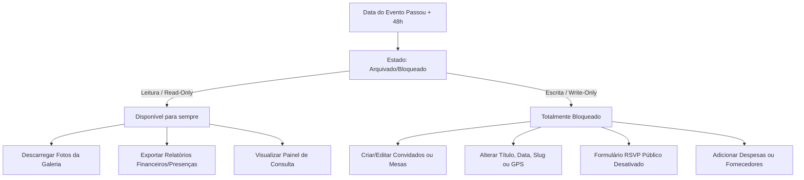

# Planeamento de Negócio: Planos Comerciais e Regras de Bloqueio

Este documento serve como registo oficial da estratégia de preços, estrutura de planos para organizadores (*Wedding Planners*) e noivos, bem como as regras de segurança para evitar o reaproveitamento não autorizado de eventos.

---

## 1. Estrutura de Planos e Preços

Para atender tanto o cliente final (Noivos) quanto o cliente corporativo (*Wedding Planners*), a plataforma disponibiliza três planos comerciais baseados no conceito de **Slots de Eventos Ativos em Simultâneo**:

| Plano | Público-Alvo | Capacidade de Slots Ativos | Preço Sugerido (AOA) | Faturamento |
| :--- | :--- | :--- | :--- | :--- |
| **Plano Noivos** | Casal individual | **1 Slot** (morre após a festa) | **45.000 Kz (Taxa Única)** | Transação Única |
| **Planner Starter** | Organizadores independentes | Até **2 Slots Ativos** em simultâneo | **20.000 Kz / mês** ou **200.000 Kz / ano** | Recorrência (SaaS) |
| **Planner Pro** | Médias e grandes agências | Até **5 Slots Ativos** em simultâneo | **40.000 Kz** ou **45.000 Kz / mês** | Recorrência (SaaS) |

> [!NOTE]
> **O que é um Slot Ativo?** 
> É o espaço reservado para um evento ativo (em planeamento ou RSVP). Assim que o casamento é concluído e arquivado pelo sistema (48h após a data da festa), o slot liberta-se automaticamente na conta do organizador para que possa criar um novo evento.
> *   **Plano Noivos:** Entrada B2C acessível (1 único slot não reutilizável).
> *   **Planner Starter:** Ideal para iniciantes. Se o planner tiver 3 clientes ao mesmo tempo, é obrigado a fazer o upgrade para o Pro.
> *   **Planner Pro:** Protege a integridade financeira do SaaS contra a partilha de contas e reflete o volume operacional real de uma agência de casamentos saudável (máximo de 5 casamentos simultâneos).

---

## 2. Regra de Ciclo de Vida do Evento (Bloqueio Automático)

Para impedir que utilizadores apaguem dados de eventos passados e os reutilizem infinitamente para novos casamentos sem pagar uma nova licença, implementamos o **Bloqueio Pós-Evento**.

*   **Prazo de Bloqueio:** **24 a 48 horas** após a data configurada para a realização do evento.
*   **Aplicação:** Aplica-se a todos os planos (Noivos, Planner Starter e Planner Pro).
*   **Lógica:** O evento passa do estado `Active` para `Archived`.

---

## 3. O que fica Bloqueado vs. Disponível após o Prazo

O bloqueio congela a escrita na base de dados para aquele ID de evento, mas garante que os noivos guardem as suas memórias e os organizadores exportem as suas listas.

### 🚫 Ações Bloqueadas (Escrita/Edição):
1.  **Formulário RSVP Público:** O link público do convidado deixa de aceitar confirmações. Caso alguém tente aceder, verá uma página elegante com a mensagem: *"Este evento já foi realizado. Obrigado pela presença!"*.
2.  **Detalhes do Evento:** Bloqueio completo na alteração de Título, Data, Slug, Imagem de Capa, Imagem de Fundo e coordenadas de GPS.
3.  **Gestão de Convidados & Mesas:** Fica desativado o CRUD de convidados, alteração de acompanhantes e o quadro de Seating Arrangement (organização de mesas).
4.  **Gestão Financeira & Fornecedores:** O orçamento, checklist de tarefas e contratos de fornecedores ficam congelados para modificação.

### ✅ Ações Disponíveis (Leitura/Consulta):
1.  **Galeria Colaborativa (Meu Boda Live):** Acesso contínuo para visualizar e descarregar as fotografias originais tiradas pelos convidados durante a festa.
2.  **Exportação de Relatórios:** Possibilidade de descarregar a listagem de presença da portaria e balanço financeiro final em PDF ou Excel.
3.  **Consulta de Portfólio (Planners):** O painel administrativo permanece acessível em modo de leitura para que os organizadores possam mostrar o funcionamento do sistema a futuros potenciais clientes.
